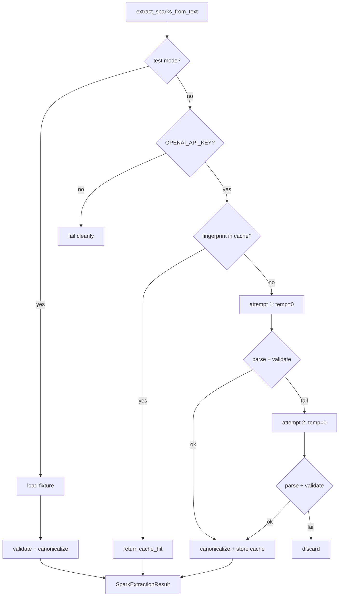

# V4.2 T5 — Extraction Determinism Hardening (Implementation Plan)

**Status:** Plan — pending Codex approval (#356)  
**Date:** 2026-07-09  
**Ticket:** #356  
**Builder:** Cursor  
**Reviewer:** Codex  
**Depends on:** V4.2 T2 (#353) spark schema extensions — **shipped**; T1/T3/T4 ingest — **shipped**

---

## Goal

Make cognitive spark extraction **repeatable and comparable** across re-ingests of the same receipt text. Live LLM calls should use **temperature=0** where supported; validated batches should have **canonical key ordering**; identical receipt text should return the **same validated structure** via a receipt-hash idempotency cache — without changing the existing **1-retry-then-discard** gate or `CROWLEY_TEST_MODE` fixture path.

**Non-goal:** bitwise-identical raw LLM output across providers or models.

---

## Problem (current state)

| Area | Today |
|------|-------|
| `extract_sparks_from_text()` | Calls `crowley._call_openai(messages, stream=False)` with **no temperature** → provider default (often > 0) |
| `model_runtime._call_openai()` | `client.chat.completions.create(model=..., messages=...)` — temperature omitted |
| Parser output | `validate_spark` applies defaults but dict key order follows insertion / model order |
| Re-ingest | Every call hits the LLM again; no fingerprint cache |
| `SparkExtractionResult` | No `cache_hit` metadata |

---

## Design principles

1. **Minimal facade wiring** — temperature passthrough only; no monolith expansion in `crowley.py`.
2. **Cache stores validated + canonical output** — never cache parse/validation failures.
3. **Prompt version in fingerprint** — bump `EXTRACTION_PROMPT_VERSION` when system/user prompts change to invalidate stale cache entries.
4. **Test mode unchanged** — `CROWLEY_TEST_MODE` still loads `tests/fixtures/spark_extraction_valid.json` without API calls.
5. **Retry semantics unchanged** — still at most 2 attempts; discard on second failure.

---

## 1. Temperature = 0 (live extraction only)

### `model_runtime.py`

Add optional kwarg to `_call_openai`:

```python
def _call_openai(
    messages: list[dict[str, str]],
    stream: bool,
    *,
    model: str | None = None,
    temperature: float | None = None,
    ...
) -> str:
    ...
    kwargs: dict[str, object] = {"model": model_name, "messages": messages}
    if temperature is not None:
        kwargs["temperature"] = temperature
    response = client.chat.completions.create(**kwargs)
```

- Default `temperature=None` → **unchanged behavior** for chat and all other callers.
- Streaming path (`_iter_openai_tokens`) unchanged — extraction uses `stream=False` only.

### `crowley.py` facade

Forward one optional kwarg (narrow wiring, ~2 lines):

```python
def _call_openai(
    messages: list[dict[str, str]], stream: bool, *, model: str | None = None,
    temperature: float | None = None,
) -> str:
    return model_runtime._call_openai(..., temperature=temperature)
```

### `spark_extraction.py`

```python
raw = crowley._call_openai(messages, stream=False, temperature=0.0)
```

Test mode and missing-key paths do not call OpenAI.

---

## 2. Canonical batch normalization

Add `canonicalize_spark_batch(sparks: list[dict[str, object]]) -> list[dict[str, object]]` in `spark_extraction.py`.

### Per-spark key order (fixed tuple)

```python
_CANONICAL_SPARK_KEYS = (
    "content",
    "lane",
    "why_keep",
    "worth_reason",
    "confidence",
    "sensitivity",
    "spark_type",
    "certainty",
    "secondary_lanes_json",
    "exposure_class",
)
```

- Emit only keys present after `validate_spark` + `_apply_spark_field_defaults`.
- `secondary_lanes_json`: parse, sort lane strings, re-`json.dumps` for stable string form.

### Batch order

Sort sparks by `(lane, content, why_keep, worth_reason)` before returning.

### Integration point

Call after every successful `_validate_batch` / empty-array success, **before** cache store and return — applies to test-mode fixture path and live path alike.

---

## 3. Receipt-hash idempotency cache

### Constants

```python
EXTRACTION_PROMPT_VERSION = "v1"  # bump when _build_attempt_*_messages change
```

### Fingerprint

```python
def receipt_fingerprint(source_text: str) -> str:
    normalized = " ".join(source_text.split())  # collapse whitespace
    payload = f"{EXTRACTION_PROMPT_VERSION}\n{normalized}"
    return hashlib.sha256(payload.encode("utf-8")).hexdigest()
```

### In-memory cache (always on)

```python
_extraction_cache: dict[str, list[dict[str, object]]] = {}

def clear_extraction_cache() -> None:
    _extraction_cache.clear()
```

- **Lookup** at start of live `extract_sparks_from_text` (after key check, before LLM).
- **Store** on successful canonical batch (including empty `[]`).
- **Do not cache** failures.

### Optional durable cache (prod)

When `CROWLEY_EXTRACTION_CACHE=1`:

- Table `spark_extraction_cache (receipt_hash TEXT PRIMARY KEY, prompt_version TEXT, sparks_json TEXT, created_at TEXT)`.
- DDL in `spark_extraction.setup_extraction_cache_table(conn)` called from existing DB setup hook if present; otherwise lazy-create on first cache write.
- Read: memory first, then SQLite; write: both.
- **Tests use in-memory only** (env unset) + `clear_extraction_cache()` in `tearDown`.

If durable wiring adds too much surface for T5, ship in-memory first and leave SQLite as a follow-up note in handoff — ticket allows "optional prod cache table **or** in-memory guard". **Default plan: in-memory only for initial ship** unless Codex wants durable in T5.

### `SparkExtractionResult` extension

```python
@dataclass(frozen=True)
class SparkExtractionResult:
    ok: bool
    sparks: list[dict[str, object]]
    errors: list[str]
    attempts: int = 0
    cache_hit: bool = False
```

Cache hit: `ok=True`, `attempts=0`, `cache_hit=True`, `_call_openai` not invoked.

### `cognitive_ingest` (optional trace)

If ingest receipt metadata already carries extraction fields, add `extraction_cache_hit` when `result.cache_hit` — **only if trivial**; not required for T5 acceptance.

---

## 4. Flow (live path)



---

## 5. Tests (`tests/test_spark_extraction.py`)

| Test | Asserts |
|------|---------|
| `test_live_extraction_uses_temperature_zero` | Mock `_call_openai`; verify `temperature=0.0` kwarg on live path |
| `test_canonical_key_order` | Valid batch returned with fixed key order per spark |
| `test_canonical_batch_sort_order` | Two sparks sorted by lane/content regardless of model order |
| `test_receipt_idempotency_cache_hit` | Same `source_text` twice → second call `cache_hit=True`, `attempts=0`, `_call_openai` once |
| `test_cache_not_used_on_failure` | Failed extraction does not poison cache; retry after success still calls LLM |
| `test_clear_extraction_cache` | `clear_extraction_cache()` resets between tests |
| Existing tests | Unchanged behavior for retry, test mode, partial rejection, empty array |

Extend `tearDown` to call `spark_extraction.clear_extraction_cache()`.

---

## 6. Files touched

| File | Change |
|------|--------|
| `spark_extraction.py` | temperature call, fingerprint, cache, canonicalize, `clear_extraction_cache`, `cache_hit` |
| `model_runtime.py` | optional `temperature` on `_call_openai` non-stream path |
| `crowley.py` | forward `temperature` kwarg (~2 lines) |
| `tests/test_spark_extraction.py` | new determinism + idempotency tests |

**Out of scope:** `cognitive_ingest.py` logic changes (unless one-line trace), ranking, promotion, chunking.

---

## 7. Acceptance mapping (#356)

| Criterion | Implementation |
|-----------|----------------|
| temperature=0 when provider supports it | `temperature=0.0` on extraction `_call_openai` calls |
| Receipt-hash idempotency | `receipt_fingerprint` + in-memory cache; tests prove re-ingest |
| Canonical JSON key ordering | `canonicalize_spark_batch` after validation |
| 1-retry-then-discard unchanged | existing attempt loop preserved |
| CROWLEY_TEST_MODE fixture path unchanged | fixture branch untouched; canonicalize applied post-validate |
| Non-goal: cross-provider bitwise identity | documented; not tested |

---

## 8. QA plan

```bash
./venv/bin/python3 -m pytest tests/test_spark_extraction.py -q
./venv/bin/python3 -m pytest tests/test_cognitive_ingest.py tests/test_spark_validation.py -q
# Facade guard if crowley.py touched:
./venv/bin/python3 -m pytest tests/test_core_runtime_extraction.py tests/test_memory_extraction.py -q
```

Full suite before Codex approval handoff.

---

## 9. Risks / mitigations

| Risk | Mitigation |
|------|------------|
| Stale cache after prompt edit | `EXTRACTION_PROMPT_VERSION` in fingerprint |
| Memory growth | Process-lifetime cache only; optional TTL out of scope for T5 |
| `crowley.py` regression | Minimal kwarg forward; re-run facade extraction tests |
| Canonical sort hides model intent order | Sort is for comparability, not user-facing display order |

---

## 10. After T5

V4.2 T6 (#357) — document lock / schema doc alignment.
