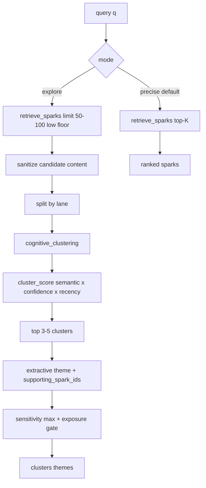

# V4.6 Explore Activation — RFC

**Status:** Architecture approved · **Do not mint** until V4.5 completion lock (#374)  
**Approved by:** Mr. Go · 2026-07-09  
**Baseline:** Crowley `4.1.0` · V4.2–V4.5 cognitive completion ladder (#352–#374)  
**Packet:** [`tickets/v4.6_explore_activation.json`](../tickets/v4.6_explore_activation.json)  
**Gap analysis:** [V4_COGNITIVE_SPEC_GAP_ANALYSIS.md](./V4_COGNITIVE_SPEC_GAP_ANALYSIS.md) § Explore activation (V4.6)

---

## One-line summary

Add a parallel `mode=explore` path that clusters weakly related sparks into **ephemeral** themes, with strict determinism, lane isolation, and sensitivity enforcement — without changing core spark storage or precise top-K guarantees.

---

## Timing gate

| Gate | Rule |
|------|------|
| Mint | Only after ticket **#374** (V4.5 cognitive completion lock) is done |
| Claim | Only after packet mint; Cursor claims T1 when directed |
| V4.3–V4.5 | **Do not amend or remint** open tickets #358–#374 for this work |

Prerequisites explore reuses (must already be shipped):

- V4.3 — query intent, lane filter, scoring profiles, 8–15 cap
- V4.4 — token budget, structured sections, chat wire
- V4.5 — sensitivity/sanitize/correction/encryption baseline

---

## Problem

Precise top-K retrieval fails when ideas are fragmented, naming is inconsistent, or individual signals are weak. The system needs a **parallel** activation path: broad candidates → weak-signal clustering → emergent themes — not a replacement for precise recall.

---

## Adopt / adapt / reject (ChatGPT context pressure-tested)

| Proposal | Verdict | Mapping |
|----------|---------|---------|
| Activation / broad→cluster→theme | **Adopt** | `activation_resolution()` |
| Parallel mode; do not replace top-K | **Adopt** | `mode=precise` (default) \| `mode=explore` |
| Reuse embeddings; no new ML infra | **Adopt** | `embed_text` + `spark_vec` / blob cosine |
| Deterministic in test mode | **Adopt** | Stable sort, fixed thresholds |
| Lane-homogeneous clusters | **Adopt** | Split by lane before cluster |
| Sensitivity = max(members); block private | **Adopt** | Reuse `spark_security` + V4.5 exposure |
| Sanitize before clustering | **Adopt** | Reuse `spark_sanitize` |
| Caps ≤100 candidates, ≤5 clusters | **Adopt** | Module constants |
| Hook `GET /api/retrieve` | **Reject** | Legacy `memory_items`; wire cognitive APIs only |
| Persist `Concept` table | **Reject for V4.6** | Ephemeral cluster dicts; persistence = V5 candidate |
| LLM `synthesize(cluster)` as core | **Reject as default** | Extractive theme first; optional LLM only behind explicit flag later |
| Synonym query expansion as V4.3 | **Defer / thin** | Optional rules-first alias expand in V4.6 T5 if explore under-activates |
| Full knowledge graph / Concept CRUD | **Reject** | Non-goal |
| Replace `patterns.py` | **Reject** | Patterns stay lifecycle detection; explore is query-time |

---

## Architecture



### Integration points

| Surface | Change |
|---------|--------|
| `spark_retrieval.py` | `mode` + `activation_resolution()`; precise path unchanged |
| `cognitive_clustering.py` | **New** — similarity grouping, centroid, caps, deterministic order |
| `context_orchestration.py` | Explore payload / trace when `mode=explore` |
| `GET /api/cognitive/context` + Actions `cognitive.context` | Add `mode=precise\|explore` |
| `GET /api/retrieve` | **No contract change** for this feature |
| `crowley.py` | Thin re-exports only |

### Explore output contract

```json
{
  "mode": "explore",
  "clusters": [
    {
      "theme": "extractive label",
      "lane": "learning",
      "supporting_spark_ids": [1, 2, 3],
      "supporting_sparks": [],
      "confidence": 0.0,
      "sensitivity": "normal"
    }
  ],
  "fallback_used": false,
  "trace": {}
}
```

When explore yields fewer than 2 viable clusters → **fallback to precise**, set `fallback_used=true`.

### Auto-switch (conservative)

Default remains **precise**. Switch to explore only when:

- explicit `mode=explore`, **or**
- all of: top-K mean score below fixed threshold; query vague / high semantic spread (V4.3 interpreter hints); not a sensitive-lane forced-precise path

No silent explore in chat until V4.4 wire + V4.6 acceptance are both green.

---

## Security (first-class)

1. **Lane isolation** — never mix lanes in one cluster
2. **Sensitivity amplification** — `cluster.sensitivity = max(members)`; omit private/high without auth
3. **No hallucinated links** — extractive theme; debug lists supporting spark IDs
4. **Sanitize before cluster** — neutralize instruction-like content on candidates first
5. **DoS caps** — `max_candidates=100`, `max_clusters=5`, `max_cluster_size` constant
6. **Determinism** — sort `(-score, spark_id)`; centroid = mean of sorted member embeddings

---

## Non-goals

- Concept table / CRUD / user-named concepts
- Replacing precise retrieval or changing canonical score constants
- LLM ranking or lane selection
- Graph DB / heavy ML clustering service
- Growing `crowley.py` beyond thin facade re-exports
- Touching open V4.2–V4.5 tickets
- Pattern → extraction feedback loop

---

## Ticket slices (mint only after #374)

| T | Title | Scope |
|---|-------|-------|
| T1 | Explore mode API + precise passthrough | `mode` on cognitive context/retrieval; precise unchanged; explore stub may `fallback_used` |
| T2 | `cognitive_clustering.py` | Lane-split clustering, caps, centroid, deterministic tests |
| T3 | `activation_resolution()` | Broad retrieve → sanitize → cluster → score → themes |
| T4 | Explore security gates | Lane homogeneity, sensitivity max, private block, sanitize-before-cluster |
| T5 | Bounded alias expand (optional thin) | Rules-first only if T3 under-activates; skip if fixtures pass without it |
| T6 | Context/trace + acceptance lock | `docs/V4.6_EXPLORE_ACTIVATION_LOCK.md`; fragmented query → themes without cross-lane leak |

---

## Mint command (after #374 only)

```bash
./venv/bin/python3 scripts/codex_sync.py --create-tickets tickets/v4.6_explore_activation.json
```

Do **not** run while V4.5 is open.
