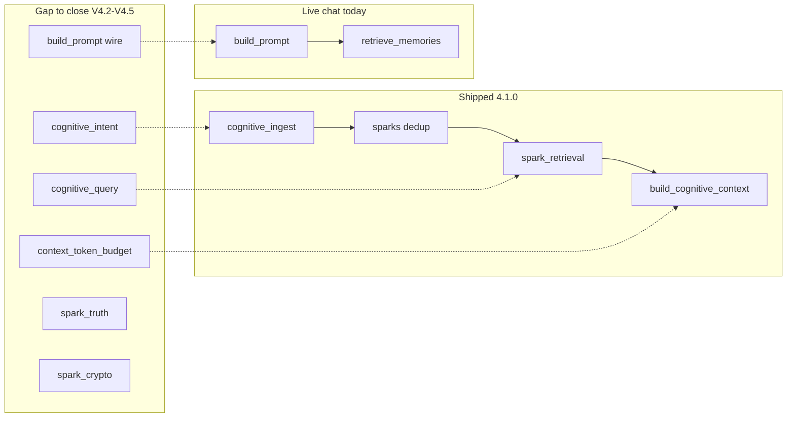

# V4 Cognitive Spec Gap Analysis

**Status:** Planning lock for V4.2–V4.5 builder ladder  
**Date:** 2026-07-09  
**Baseline:** Crowley `4.1.0` — V4.0 cognitive memory (#203–#226) + V4.1 architecture (#316–#325)  
**Spec source:** ChatGPT V4 cognitive-memory operational blueprint (Mr. Go approved)  
**Tickets:** #352–#374 · packets `tickets/v4.2_*.json` through `v4.5_*.json`

This document maps each spec layer to shipped code, adopt/adapt/reject decisions, and the V4.2–V4.5 ticket that closes the gap. Cursor implements; Codex reviews via handoffs only.

---

## Executive summary

Crowley already ships a **storage → retrieval → API** cognitive spine. The spec gap is **closing the loop**: messy input gating, query intelligence, token-bounded context, live chat wire, truth/correction, and encryption — without breaking V4.0 safeguards (T18–T20) or V4.1 facade contracts.

---

## Layer matrix

| # | Spec layer | Shipped today | Key files | Maturity | Decision | Closes in |
|---|------------|---------------|-----------|----------|----------|-----------|
| 1 | Input processing | LLM multi-spark ≤5, validation, async ingest | `spark_extraction.py`, `cognitive_ingest.py`, `sparks.py` | Partial | **Adopt** intent, chunking, determinism | V4.2 #352–#357 |
| 2 | Domain system | 6 fixed lanes, manual `?lane=` filter | `sparks.py`, `spark_retrieval.py` | Strong lanes / weak auto | **Adapt** aliases + secondary | V4.2 #353, V4.3 #359 |
| 3 | Memory structure | lane, confidence, trust_state, sensitivity | `sparks.py` | Strong base | **Adapt** type, certainty, exposure | V4.2 #353 |
| 4 | Lifecycle | dedup, decay, stale, maintenance | `spark_lifecycle.py`, `cognitive_maintenance.py` | Strong | **Extend** promotion + correction triggers | V4.2 #355, V4.5 #369–#370 |
| 5 | Retrieval control | hybrid score, lane filter, depth limits | `spark_retrieval.py`, `context_resolution.py` | Strong deterministic | **Adapt** query modes, cap 15, auto lane | V4.3 #358–#361 |
| 6 | Context orchestration | count limits, sanitize, API only | `context_orchestration.py`, `spark_sanitize.py` | Partial | **Adopt** token budget, sections, chat wire | V4.4 #363–#367 |
| 7 | Truth management | trust_state; memory_items conflict only | `sparks.py`, `conflict_engine.py` | Partial | **Adopt** spark truth arbitration | V4.5 #369 |
| 8 | Security | T18–T20 gates; encryption deferred | `spark_security.py`, `spark_sanitize.py` | Strong local / no crypto | **Adopt** encryption + backup | V4.5 #372–#373 |
| 9 | Trust and visibility | lineage, observability, trace | `observability_store.py`, `context_orchestration.py` | Strong | **Extend** inspection tools | V4.5 #371 |
| 10 | Feedback / correction | writeback corrections passthrough only | `portable_writeback_sparks_bridge.py` | Weak | **Adopt** correction API | V4.5 #370–#371 |

---

## Layer 1 — Input processing

### Spec requires

Multi-spark extraction, context boundaries, document decomposition, ambiguity tags (tentative/exploratory/confirmed), intent (store/ignore/temporary), secret redaction, deterministic hybrid output.

### Shipped

- `extract_sparks_from_text()` — JSON array, max 5, 1 retry, discard batch on failure (`spark_extraction.py`)
- `POST /api/cognitive/ingest` — receipt + async/sync extraction (`cognitive_ingest.py`)
- `validate_spark()` — rejects instructions, secrets, wrappers (`sparks.py`)

### Gaps

- No pre-extraction intent gate
- No long-document chunking
- No certainty field; trust_state ≠ tentative/confirmed
- LLM variability without receipt-hash idempotency

### Decision

| Item | Verdict |
|------|---------|
| Intent classifier before extraction | **Adopt** — `cognitive_intent.py` (#352) |
| Document chunking | **Adopt** — `cognitive_chunking.py` (#354) |
| Bitwise deterministic LLM output | **Reject** — use rules-first + temp=0 + idempotency cache (#356) |
| store/ignore/temporary | **Adopt** (#352) |

---

## Layer 2 — Domain system

### Spec requires

finance, health, career, learning, general; primary + secondary domain; domain-aware parsing; filter before scoring.

### Shipped

`SPARK_LANES`: learning, work, relationships, money, health, operating_style. Strict enum in `validate_spark()`.

### Decision

| Spec domain | Crowley lane | Verdict |
|-------------|--------------|---------|
| finance | money | **Adapt** — `DOMAIN_ALIASES` (#353) |
| career | work | **Adapt** |
| learning | learning | Keep |
| health | health | Keep |
| general | operating_style, relationships | **Adapt** — map at ingest/query |

| Item | Verdict |
|------|---------|
| Rename SPARK_LANES values | **Reject** — DB compatibility |
| secondary_lanes_json | **Adopt** (#353) |
| Auto lane from query | **Adopt** (#359) |
| Typed parsing (amount, metric) | **Defer post-V4.5** — optional JSON in tags, not V4.2 blocker |

---

## Layer 3 — Memory structure

### Spec minimum

type (fact/decision/intent/observation), domain, timestamp, state (active/inactive, tentative/confirmed), confidence, sensitivity (public/private/sensitive).

### Shipped

lane, confidence 0–1, trust_state (candidate/active/stale/pinned/rejected), sensitivity (normal/sensitive/high), timestamps, lineage.

### Decision

| Spec field | Crowley mapping | Verdict |
|------------|-----------------|---------|
| type | new `spark_type` column | **Adopt** (#353) |
| tentative/confirmed | new `certainty` column | **Adopt** (#353) |
| active/inactive | `trust_state` | **Adapt** — keep trust_state; certainty is orthogonal |
| public/private/sensitive | sensitivity + `exposure_class` | **Adapt** (#353) |
| Rename sensitivity enum | | **Reject** — extend, don't migrate |

See [V4.2_SCHEMA_RFC.md](./V4.2_SCHEMA_RFC.md).

---

## Layer 4 — Lifecycle

### Spec requires

Dedup, decay, stale, correction (override/update/invalidate); triggers on ingest, retrieval, periodic.

### Shipped

- Dedup merge ≥0.95, link ≥0.85 (`sparks.py`)
- Read-time decay 30-day half-life (`spark_lifecycle.py`)
- Stale → rejected via maintenance (`cognitive_maintenance.py`)
- No spark correction API

### Decision

| Item | Verdict |
|------|---------|
| Dedup/decay/stale | **Keep** — document as shipped |
| Promotion candidate→active | **Adopt** (#355) |
| Correction on ingest | **Adopt** (#370) |

---

## Layer 5 — Retrieval control

### Spec requires

Query interpretation (recall/decision/reflection/planning), domain scoping before scoring, ranking order confidence>recency>domain>semantic, hard cap 8–15 sparks.

### Shipped

Weighted hybrid: 0.40 semantic + 0.25 confidence + 0.15 recency + 0.20 graph (`spark_retrieval.py`). Optional `lanes` param. Medium depth up to 32 sparks (`context_resolution.py`).

### Decision

| Item | Verdict |
|------|---------|
| Fixed global sort order | **Reject** — use query-mode weight profiles (#360) |
| Query interpreter | **Adopt** (#358) |
| Filter before score | **Adopt** — extend existing lane filter (#359) |
| Cap 15 default | **Adopt** (#361) |
| confirmed > tentative in ranking | **Adopt** (#360) |

---

## Layer 6 — Context orchestration

### Spec requires

Token budget, top-N, domain enforcement, structured sections (Current State / Decisions / Recent / Constraints), never raw dump to model.

### Shipped

Count-based depth limits, core/supporting/patterns split, sanitization, cold-start legacy fallback. **Not wired to chat.**

### Decision

| Item | Verdict |
|------|---------|
| Token budget packer | **Adopt** (#363) |
| Fixed four sections | **Adopt** (#364) |
| Chat wire | **Adopt** (#365) — see [V4_CHAT_WIRE_RFC.md](./V4_CHAT_WIRE_RFC.md) |
| Replace canon/world prompt layers | **Reject** — cognitive sits below authority stack |

---

## Layer 7 — Truth management

### Spec requires

Coexist past/present, tentative→confirmed, precedence rules, conflict detect + downgrade older, no auto-delete.

### Shipped

`trust_state` only. `conflict_engine.py` handles `memory_items`, not sparks.

### Decision

| Item | Verdict |
|------|---------|
| Spark pairwise conflict | **Adopt** — `spark_truth.py` (#369) |
| Deep multi-hop arbitration | **Reject for V4** — V5+ per spec out-of-scope |
| Auto-delete on conflict | **Reject** |

---

## Layer 8 — Security

### Spec requires

Field encryption (finance/health/personal), secret redaction, localhost API, sensitivity tags, encrypted backup, enforcement at ingest/storage/retrieval.

### Shipped

Write-time validation (T20), retrieval gates (T18), output sanitization (T19), `content_encrypted` column unused.

### Decision

| Item | Verdict |
|------|---------|
| Redaction + sensitivity gates | **Keep** |
| Field-level encryption | **Adopt** — V4.5 only (#372) |
| Encrypted backup | **Adopt** (#373) |
| OAuth/public hosting | **Reject** — V4.1 baseline |

---

## Layer 9 — Trust and visibility

### Spec requires

Confidence surfaced, memory inspection, audit logs (ingestion, retrieval).

### Shipped

`lineage_json`, `trace` in context, observability hash chain (#224), cognitive API dispatch logging.

### Decision

| Item | Verdict |
|------|---------|
| Lineage/observability | **Keep** |
| Actions inspect tools for sparks | **Adopt** (#371) |
| Full UI review surface | **Defer** — minimal Actions tools sufficient for V4.5 |

---

## Layer 10 — Feedback / correction

### Spec requires

User correct/invalidate; corrections update sparks; no silent persistent errors.

### Shipped

Portable writeback `corrections` field not applied to spark rows. Re-ingest/dedup only path.

### Decision

| Item | Verdict |
|------|---------|
| POST correct/invalidate API | **Adopt** (#370) |
| Writeback bridge to same handler | **Adopt** (#370) |
| Actions promote/reject | **Adopt** (#371) |

---

## Explore activation (V4.6 — post–V4.5)

**Status:** Architecture approved 2026-07-09 · **Do not mint** until #374  
**RFC:** [V4.6_EXPLORE_ACTIVATION_RFC.md](./V4.6_EXPLORE_ACTIVATION_RFC.md)  
**Packet:** `tickets/v4.6_explore_activation.json` (approved architecture; mint gated on #374)

### Spec requires (ChatGPT V4+ extension)

Activation-based retrieval (broad → weak signals → cluster → themes), concept identity, query expansion, clustering engine, synthesis, `precise|explore` modes, aggregation security.

### Shipped / planned before V4.6

- Precise hybrid top-K — `spark_retrieval.py`
- Graph hop expansion — `spark_graph.py`
- Pattern clustering (lifecycle) — `patterns.py`
- Query intent / lane / profiles / 8–15 cap — V4.3 #358–#361
- Sanitize + sensitivity — `spark_sanitize.py`, `spark_security.py` (+ V4.5)

### Decision

| Item | Verdict |
|------|---------|
| Parallel `mode=explore` activation path | **Adopt** — after #374 |
| Ephemeral clusters (no Concept table) | **Adopt** |
| Extractive themes; no LLM synthesis default | **Adopt** |
| Lane-homogeneous + sensitivity max + sanitize-before-cluster | **Adopt** |
| Wire cognitive context / spark_retrieval only | **Adopt** |
| Hook `GET /api/retrieve` | **Reject** |
| Persist Concept ontology in V4.6 | **Reject** — V5 candidate |
| Replace precise top-K or `patterns.py` | **Reject** |
| Synonym explosion query expansion | **Reject**; optional bounded rules-first alias expand only if needed |
| Amend open V4.3–V4.5 tickets for this | **Reject** |

Closes in: **V4.6** (mint after #374) — see RFC ticket slices T1–T6.

---

## Spec out-of-scope clarifications

| Spec says out of scope | Crowley reality | Resolution |
|------------------------|-----------------|------------|
| MCP tools | V4.1 `crowley_tools.py` contract + `cognitive.context` | MCP **transport** = V5; tool contract **shipped** |
| Pattern-based actions | V4.0 `patterns.py` clustering | Pattern **detection** stays; **automated actions** = V5 |
| Deep truth arbitration | Deferred V4.1 | Pairwise spark truth in V4.5; deep arbitration V5 |
| Automation / execution | — | V5 north star |
| Concept persistence / Concept CRUD | Not in V4.0–V4.5 | Ephemeral explore clusters in V4.6; persistence = V5 candidate |

---

## Dual memory path risk

Until V4.4 ships, chat uses `retrieve_memories()` on `memory_items` while cognitive API uses sparks. Mitigation sequence:

1. V4.2 promotion policy (#355) grows active spark pool
2. V4.4 chat wire (#365) prefers cognitive context
3. V4.4 fallback tiering (#366) labels legacy path explicitly

---

## Release ladder summary

| Release | Tickets | Exit acceptance tests |
|---------|---------|----------------------|
| V4.2 Input Intelligence | #352–#357 | 1 messy input, 5 noise resistance |
| V4.3 Retrieval + Query | #358–#362 | 2 clean retrieval |
| V4.4 Context + Chat Wire | #363–#367 | 3 context control |
| V4.5 Truth + Security Lock | #369–#374 | 4 state evolution, 6 security + full suite |
| V4.6 Explore Activation | mint after #374 | fragmented→themes; no cross-lane leak; precise default unchanged |

Full matrix: [V4_ACCEPTANCE_TEST_MATRIX.md](./V4_ACCEPTANCE_TEST_MATRIX.md)

---

## Related docs

- [V4.2_SCHEMA_RFC.md](./V4.2_SCHEMA_RFC.md) — additive columns and migration policy
- [V4_CHAT_WIRE_RFC.md](./V4_CHAT_WIRE_RFC.md) — prompt authority order
- [V4.6_EXPLORE_ACTIVATION_RFC.md](./V4.6_EXPLORE_ACTIVATION_RFC.md) — post–V4.5 explore/activation (do not mint until #374)
- [V4.0_COGNITIVE_MEMORY_RELEASE_LOCK.md](./V4.0_COGNITIVE_MEMORY_RELEASE_LOCK.md) — shipped baseline
- [V4.1_FINAL_ARCHITECTURE_AUDIT.md](./V4.1_FINAL_ARCHITECTURE_AUDIT.md) — architecture + deferred debt
